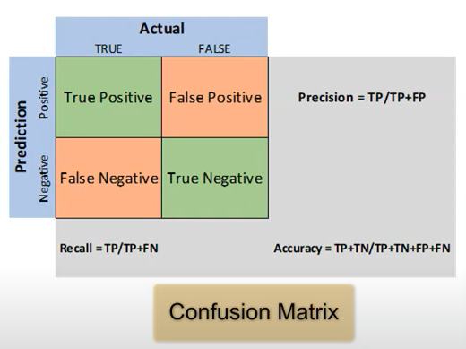

# AI-900 Fundamentals

### Six Principles for responsible AI

1. Faireness
2. Reliability and safety
3. Privacy and security
4. Inclusiveness
5. Transparency
6. Accountability

### AI - Key Elements

Machine Learning

Anomaly Detection

Computer Vision

Natural Language Processing

Conversational AI

---

## Machine Learning

### Automated Machine Learning

Supervised Training Models
- Classification 
- Regression
- Time series forecasting

Explain Best Selected Model
- Calculates feature importance for the best model
- Determines the influence of each feature on the predicted label

Blocked Algorithms
- Block selected Algorithms
- Gives control on time

Exit Criterion
- Training job time (hours)
- Metric score threshold

### Evaluated Model - Regression

- Mean Absolute Error (MAE) : The average difference between predicted values and true values.
- Root Mean Squared Error (RMSE) : The square root of the mean squared difference between predicted values and true values.
- Relative Squared Error (RSE) : A relative metric between 0 and 1 based on the square of the difference between predicted values and true values.
- Relative Absolute Error (RAE) : A relative metric between 0 and 1 based on the difference between predicted values and true values.
- Coefficient of Determination (R^2) : This metric summarize how much of the variance between predicted values and true values.

### Evaluation Model - Classification

- Accuracy : The ration of correct predictions (TP + TN) to the total number of predictions.
- Precision : The fraction of positive cases correctly identified. (TP / (TP+FP))
- Recall : The fraction of the cases classified as positive that are actually positive. (TP/(TP+FN))
- F1 Score : An overall metric that essentially combines precision and recall.
- AUC (Area Under the Cover) : Binary Classification = 0.5 indicates random result, 1 - indicated best fit.

### Evaluation Model - Clustering

- Average Distance to Other Center : This indicates how close, on average, each point in the cluster is to the centroids of all other clusters.
- Average Distance to Cluster Center : This indicates how close, on average, each point in the cluster is to the centroid of the cluster.
- Number of Points : The number of points assigned to the cluster.
- Maximum Distance to Cluster Center : The max distance between each point and the centroid of that points cluster. If this number is high, the cluster may be widely dispersed. This statistic in combination with the Average Distance to Cluster Center helps determine the cluster's spread.
- Combined evaluation

### Azure Machine Learning designer

Deploy a machine learning model with the designer
- create a real-time interference pipeline
- create an inferencing cluster
- deploy the real-time endpoint
- test the real-time endpoint

Language which can be used
- Python
- R

### Data and Compute Management

### Pipelines

---

## Anomaly Detection

- Provides API
- Ingest time-series data if all types and selects the best-fitting detection model 
- Customizable to detect any level of anomalies and deploy it on cloud or intelligent edge with containers

---

## Computer Vision

### CV - Key Elements

Image Classification 

Object detection

Semantic segmentation

Image analysis

Face detection, analysis, and recognition

Optical Character recognition (OCR)

### Computer Vision Services

- Computer Vision : You can use this service to analyze images and video, and extract descriptions, tags, objects, and text.
- Custom Vision : Use this service to train custom image classification and object detection models using your own images.
- Face : The face service enable you to build face detection and facial recognition solutions.
- Form Recognizer : Use this service to extract information from scanned forms and invoices.

### Computer Vision

Features:
- Interpret an image and suggest an appropriate caption
- Suggest relevant tags that could be used to index an image
- Categorize an image
- Identify object in an image
- Detect faces and people in an image
- Recognize celebrities and landmarks in an image
- Read text in an image
- - Optical Character recognition (OCR) : to recognize individual shapes as letters, numerals, punctuation, or other elements of text.
- - Machine Reading Comprehension (MCR) : not only reads the text characters, but can use a semantic model to interpret the text is about

OCR API
- For small amounts of text in images
- Works synchronously
- Info returned:
- - Regions in the image that contains text
- - Lines of text in each region
- - Words in each line of text 

The Read API
- For scanned documents that have a lot of text
- Works asynchronously
- Info returned:
- - Pages : One for each page of text, including information about the page size and orientation
- - Lines : The lines of text on a page
- - Words : The words on a line of text

### Custom Vision

Features:
- Image Classification : applies one or more labels to an image
- Object detection : is similar, but it also returns the coordinates on the image where the applied labels can be found

Model evaluation metrics:
- Precision : What percentage of the class predictions made by the model were correct?
- Recall : What percentage of the class predictions did the model correctly identify?
- Average Precision : An overall metric that takes into account bot precision and recall 

### Face

Features:
- Face Detection
- Face Verification
- Find Similar Faces
- Group faces based on similarities
- Identify people

Face Detection Attributes
- Face Emotion Detection : happiness, sadness, neutral, anger, contempt, disgust, surprise, and fear
- Makeup Detection : Whether the face has makeup. This attribute returns a Boolean value for eyeMakeup and lipMakeup. 

Images for most accurate recognition results:
- JPEG, PNG, GIF, BMP
- Image file no larger than 6MB
- When you create Person object, use photos that feature different kinds of angle and lighting
- Some faces might not be recognized because of technical challenges such as:
- - images with extreme lighting
- - obstruction that blocks one or both eyes
- - changes in hair type or facial hair
- - changes in facial appearance because of age
- - extreme facial expressions

### Form Recognizer

Model Supported 
- A pre-build receipt model that provide out-of-the-box, and is trained to recognize and extract data from sales receipts.
- Custom model which enable you to extract what are known key/value pairs and table data forms.

For best results when using a custom model :
- JPG, PNG, BMP, PDF, or TIFF formats
- Files size not larger than 50MB
- Image size between 50 x 50 px and 10,000 x 10,000 px
- Pdf documents no larger than 17 x 17 inches

Information from the receipt slip:
- time of transaction
- date of transaction
- merchant information
- taxes paid
- receipt totals
- other pertinent information that may be present on the receipt
- all text on the receipt is recognized and returned as well

---

## Natural Language Processing

Text analytics : use this service to analyze text documents and extract keys phrases, detect entities, and evaluate sentiment.

Translator Text : use this service to translate text between more than 60 languages

Speech : Use this service to recognize and synthesize speech, and to translate spoken languages.

Language Understanding Intelligent Service (LUIS) : use this service to train a language model that can understand spoken or text-based commands.

### Text analytics

Capabilities:
- Determine the language of a document or text
- Perform sentiment analysis on text to determine a positive or negative sentiment
- Extract key phrases from text that might indicate4its main talking points
-  Identify and categorize entities in the text

### Translator Text

Translation Types:
- Literal translation : Word wise translation
- Semantic translation : Phrase wise translation. (Grammar rules are considered)

Features:
- Supports text-to-text translation between more than 80 languages
- Supports one to multiple language simultaneously translate
Optional Configurations
- Profanity filtering
- Selective translation

### Speech

Capabilities:
- Speech recognition : the ability to detect and interpret spoken input
- - acoustic model : converts audio signal into phonemes  
- - language model : maps phonemes to words, usually using a statistical algorithm that predicts the most probable sequence of words based on the phonemes
API
- Speech-to-text : used to transcribe speech from an audio source to text format.
- Text-to-speech : used to generate spoken audio from a text source.
- Speech Translation : used to translate speech in one language to text or speech in another

### Language Understanding Intelligent Service (LUIS) 

Three concepts:
- utterance
- entities
- intents

Language Understanding : A dedicated resource for language understanding which can be either authoring or prediction resource.

Authoring - Four types of entities:
- Machine-Learned : entities that are learned by your model during training from context you provide 
- List: entities that are defined as a hierarchy of list and sublists
- RegEx : regular expressions that describe a pattern
- Pattern : patterns defined complex entities

---

## Conversational AI

QnA Maker : Quickly build a knowledge based of questions and answers that can form the basis of a dialog between a human and an AI agent (Can’t be Multi-Language)

Azure Bot Services : This service provides a platform for creating, publishing and managing bots.

Bot Framework : For complex bots which need lot more customization.

---
