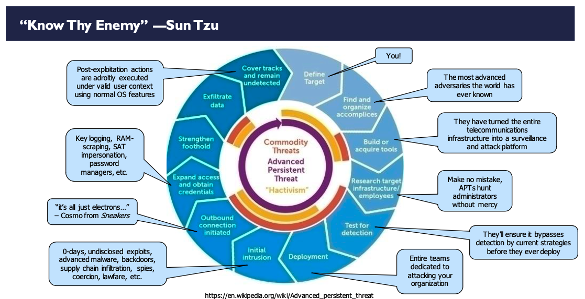
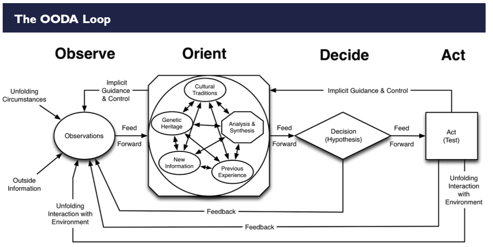
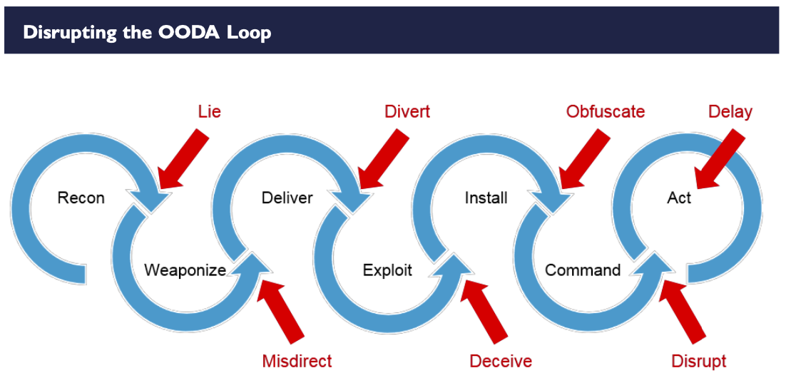
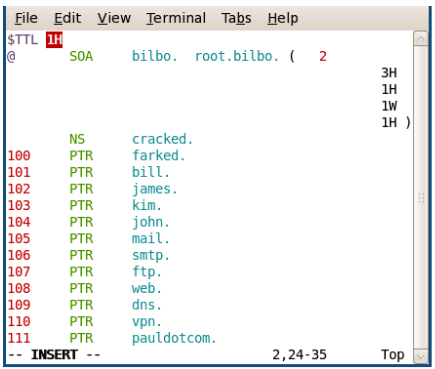
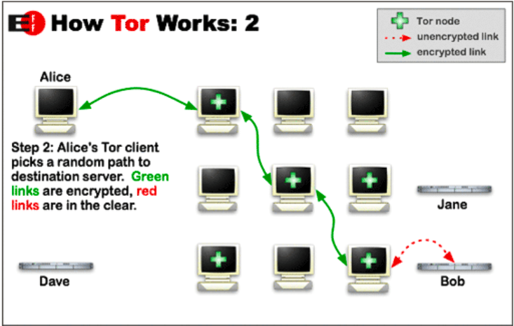

# Active Defense and Cyber Deception

Description

## Definition and Diclaimer

Active Defense : Defense that "responds"

Passive Defense : Prevention | Detection | Response

Cyber Deception : Increase attacker "work effort"

### What is Offensive Countermeasures?

- Offensive countermeasures employs offensive techniques as agressors attack but in a defensive posture.

- Think poison, not venom.

- Always ensure solid legal foothing. (Proper authorization, warrant, written approval)

- Detection time + Reaction time < Attack time

### What is Cyber Deceptions?

- Cyber Deceptions is the deliberate and calculated process of deceiving attacks in an effort to wage a better defense







---

## Lagal Contraints

DONT BE EVIL

DONT HACK THE HACKERS!

### Traps : What you can do?

- Word Web Bugs

- Geolocation apps

- Callback PDF

- Callback XLS

- HTML code to prevent /detect scraping

- Honeypots

- Digital Code Signing Certs

- Callback Videos

### Traps : What you can't do?

- Persistent intrusion

- Remote access

- Disruption (DOS/DDOS/Malware)

---

## Cheap Cyber Deception

### Active Directory HoneyAdmin

```
Create obvious accounts
Disable Account logon hours
Make Alerts on logon attempts
```

### HoneyShare and HoneyDoc

A collection of Python classes for working with network protocols.

[Impacket Github](https://github.com/SecureAuthCorp/impacket)

Canarytokens helps track activity and actions on your network.

[Canary Tokens](https://canarytokens.org/generate)

### HoneyDNS

```
Create large ammount of DNS records pointing to unused IP address space 
Then log, alert and drop addresses that request for these systems
```



### Polarbear

[PolarBear Github](https://github.com/polrbearproject/polrbear)

### Evil Web Servers

An http server that responds with an ever-expanding web of links. Use it to test, benchmark, and confuse web crawlers.

[Spider Trap Github](https://github.com/omarkhan/spidertrap)

```
python3 spidertrap.py /usr/share/Dirbuster/directory-list-2.3.big.txt
```

---

## How to not get burned

### Basic setup 

- Setup the server via name/e-mail that is not a real person

- Register all this through a non-attributable e-mail/paypay/domain/hosting

### Non-Attributable E-mail

- Avoid Google/Microsoft

- Use ProtonMail

- Verify all registration using this email

- Use a very strong passphrase/password

- Use famous place that has nothing to do with you in any way

### Hosting/Doamin Providers

- Create your non-attributable instance and prepare to destroy it

- Provider need to accept Paypal or prepaid gift cards

### Burner Phones

- Essential to confirm account details

- Can be purchased from about anywhere

### Paying

- Do not use personal/corporate credit card

- Pay with cash

- $100 - $500 enough for 2-6 months

---

### Honeypots

Object that is intended to be interacted with by an attacker, not legitimate users

Ideally, it should resemble something valuable to you and or your organizatio

Focus on:

- Identifying machine internal systems and users

- Identidying attacks that AV and IDS miss

- Our incident-handling procedures

Fail2Ban

Scans log files (e.g. /var/log/auth_log) and bans IPs that show the malicious signs -- too many password failures, seeking for exploits, etc.

[Fail2ban Webpage](https://www.fail2ban.org/wiki/index.php/Main_Page)

DenyHosts 

A utility developed by Phil Schwartz and maintained by a number of developers which aims to thwart sshd (ssh server) brute force attacks.

[DenyHosts](https://github.com/denyhosts/denyhosts)

---

### Honeyports

```
#!/bin/bash

echo "Started"

while [1]
do 
    IP=`nc -nlv 1025 2>&1 1> /dev/null | grep received | awk -F '[] []' '{print $3;}'`
    IPTABLES -A INPUT -P tcp -s $IP -j DROP
    echo -- $IP has been bloocked!
done
```

### Portspoof

Cowrie

A medium to high interaction SSH and Telnet honeypot designed to log brute force attacks and the shell interaction performed by the attacker. 

[Cowrie Github](https://github.com/cowrie/cowrie)

Artillery

A combination of a honeypot, monitoring tool, and alerting system.

[Artillery Github](https://github.com/BinaryDefense/artillery)

### More Evil Web Servers

SNARE

A web application honeypot sensor attracting all sort of maliciousness from the Internet.

[SNARE Github](https://github.com/mushorg/snare)

### Application Specific Honeypots

SCADA System

---

## Attribution

Know what they are after

Undersahtnd what they already have

### Dealing with TOR



TOR is not just used by browsers

SOCKS-5 and proxychains might be in play

Usefull for nmap scans

```
proxychains nmap -PN -sT -p 80 <IP>
```

### Honeytokens

Canarytokens helps track activity and actions on your network.

[Canary Tokens](https://canarytokens.org/generate)

### Word Web Bugs (Honeydocs)

asd

### Infinetely Recursive Windows Directory

Stops RANSOMWARE

```
cd \
mkdir \goaway
cd goaway
mklink /D dir1 c:\goaway\
mklink /D dir2 c:\goaway\
```

---

## Attack

### Wireless


### Exit Java Apps wit SET


### AV Bypass


Virus checking Options

Virustotal

[Virustotal Page](https://www.virustotal.com/gui/)

### Honeyclaymores


### Arming Documents


### HoneyBadger


----
