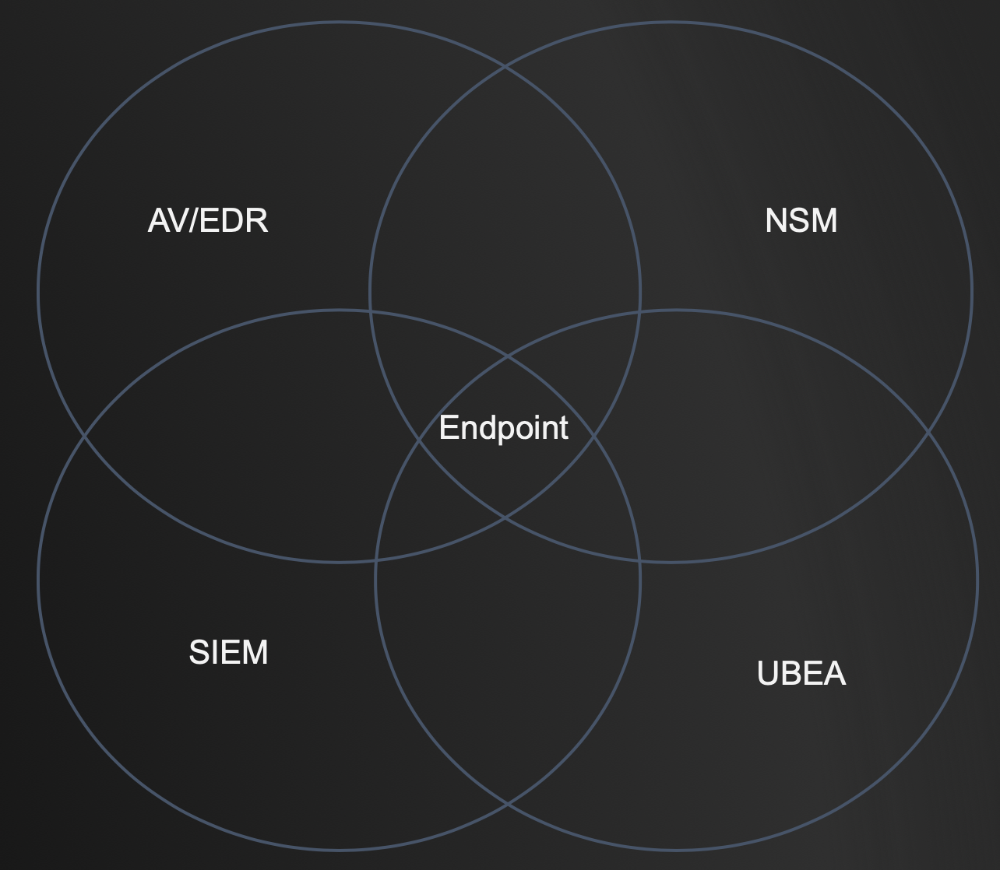
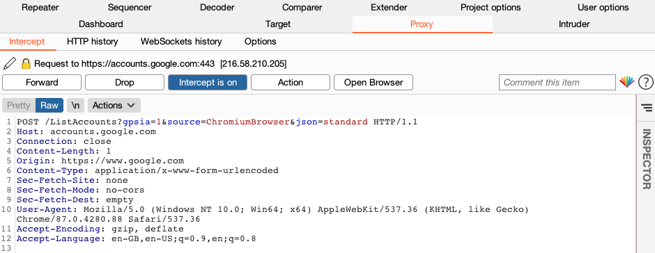
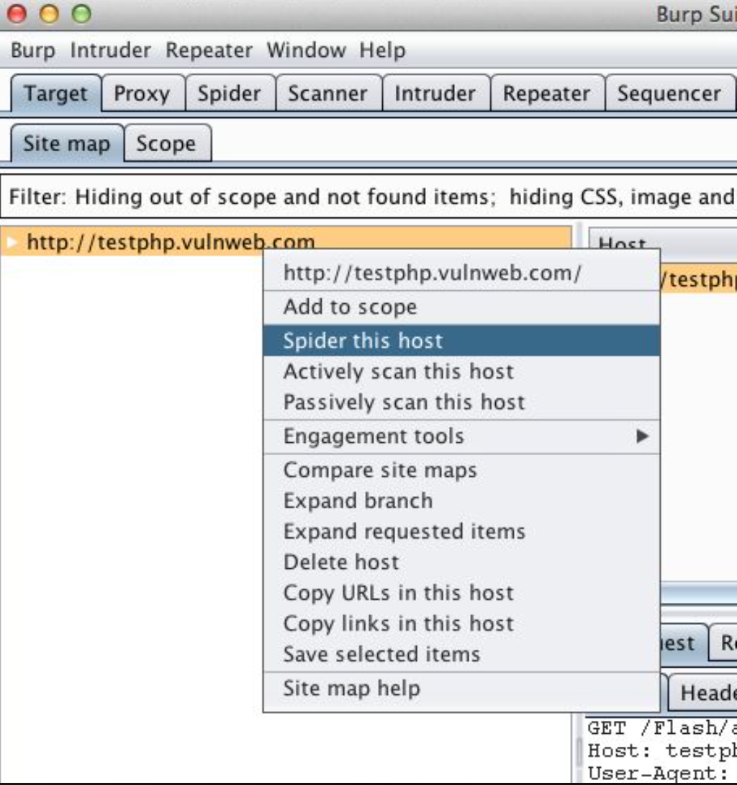
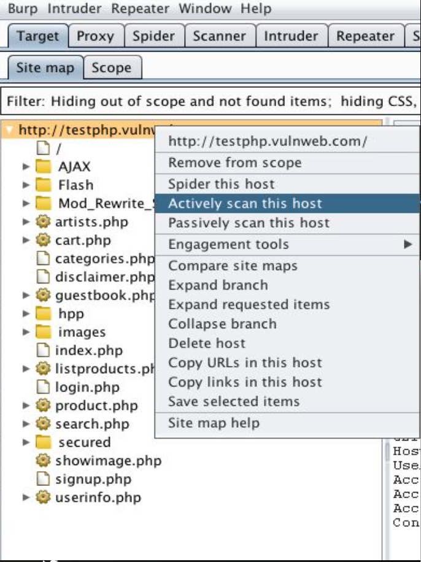

# Getting Started with Security

Description

## Compliance and Critical Controls

[Audit Scripts](https://www.auditscripts.com/free-resources/critical-security-controls/)

[MITTRE ATT&CK](https://attack.mitre.org/matrices/enterprise/)

Mapping the MITRE to Critical Control

- Application Allow Listing

- Password Controls

- Egress Traffic Analysis

- UEBA

- Advanced Endpoint Protection

- Logging

- Host Firewall

- Internet Allow Listing

- Vulnerability Management

- Active Directory Hardening

- Backup and Recovery

---

## Application Allow Listing

### Denylisting Fails : Re-compile Assembly

Re-compile to assembly

1. create .exe

2. convert it to an .asm file

3. edit the .asm file

4. convert it back to an .exe file

### Denylisting Fails : LOL Bins

Living Off The Land Binaries and Scripts

[Lolbas Github](https://lolbas-project.github.io/)

### Allow Listing Approach : Directories

- identify directories that are allowed to execute programs

- many initial access attacks require execution from:

- - Downloads

- - Desktop

- - Temporary Internet directories for browser

### Allow Listing Approach : Hash

- only allow hash of trusted apps

- identify only what is needed to run

- easy concept, very difficult to implement

### Allow Listing Approach : Digital Cert / Publisher Verification

- verify app through signed certs

- focus on reviewing digital code signing cert

-  however many vendors do not sign all their .exe and .dlls

### Applocker

An application whitelisting technology that allows restriction on which programs users can execute based on the program's path, publisher, or hash, and in an enterprise can be configured via Group Policy.

[Applocker]()

---

## Password Controls

### Password Problems : Password Spaying

- using the same password across multiple accounts

- required to conduct user harvesting attack first

### Password Problems : Short Passwords

- organizations have password policies that are 8 - 10 characters and because they have 2FA

- only works if 100% of authentication API have 2FA

### Password Problems : Hidden 2FA Bypass

- has only to find one portal that does not support 2FA

- then, all accounts and passwords they have harvested can be used

### Common 2FA

- Token based 

- SMS Based

- App-based

### Rubeus : Kerberoasting

A C# toolset for raw Kerberos interaction and abuses.

[Rubeus Github](https://github.com/GhostPack/Rubeus)

### Responder

An LLMNR, NBT-NS and MDNS poisoner.

[Responder Github](https://github.com/SpiderLabs/Responder)

### Credking

Password Spraying using AWS Lambda for IP rotation.

[Credking Github](https://github.com/ustayready/CredKing)

### Evilginx

A man-in-the-middle attack framework used for phishing login credentials along with session cookies, which in turn allows to bypass 2-factor authentication protection.

[Evilginx  Github](https://github.com/kgretzky/evilginx2)

### Use : Password Managers

[Last Pass Homepage](https://www.lastpass.com/)

[onelogin Homepage](https://www.onelogin.com/)

### Use : Privilege Identity Management

[beyondTrust Homepage](https://www.beyondtrust.com/)

[Centrify Homepage](https://www.centrify.com/)

---

## Egress Traffic Analysis

### Netflow

A network protocol for collecting IP traffic information and monitoring network flow.

[SolarWinds Netflow](https://www.solarwinds.com/netflow-traffic-analyzer/use-cases/what-is-netflow)

### Zeek

A powerful framework for network traffic analysis and security monitoring.

[Zeek Github](https://github.com/zeek/zeek)

### RITA

An open source framework for network traffic analysis.

[RITA Github](https://github.com/activecm/rita)

### JA3

A method for creating SSL/TLS client fingerprints that should be easy to produce on any platform and can be easily shared for threat intelligence.

[JA3 Github](https://github.com/salesforce/ja3)

### Security Onion

A free and open source Linux distribution for threat hunting, enterprise security monitoring, and log management.

[Security Onion Github](https://github.com/Security-Onion-Solutions/security-onion)

---

## User Entity Behavior Analytics

### How UEBA Works: Stacking

- User Login = +1 

- User Logout = -1

- Example: @Threshold of 6 per day

- (Password Spray Attack Happen)

- User Login = +2000 --> will trigger alert

### How UEBA Works: AI

- AI learns what is normal for each user account 

- Example:

- Bob normally logs into 3 systems every day

- Bob logs into 40 systems --> will trigger alert

---

## Advanced Endpoint Protection



- Any of these tools can be bypassed, but very rarely see an attacker bypass all of these

- So if these tools is used as an architecture then it help reduce the risk of catastrophic failure 

### Bluespawn

An active defense and endpoint detection and response tool which means it can be used by defenders to quickly detect, identify, and eliminate malicious activity and malware across a network.

[Bluespawn Github](https://github.com/ION28/BLUESPAWN)

### Caldera

A cyber security framework designed to easily run autonomous breach-and-simulation exercises. It can also be used to run manual red-team engagements or automated incident response.

[Caldera Github](https://github.com/mitre/caldera)

### Atomic Red Team

A library of simple tests that every security team can execute to test their controls. 

[Atomic Red Team Github](https://github.com/redcanaryco/atomic-red-team)

### Bloodhound

Attackers can use BloodHound to easily identify highly complex attack paths that would otherwise be impossible to quickly identify. Defenders can use BloodHound to identify and eliminate those same attack paths.

[Bloodhound Github](https://github.com/BloodHoundAD/BloodHound)

---

## Logging

### JPCert Logon tracer

A tool to investigate malicious logon by visualizing and analyzing Windows Active Directory event logs. This tool associates a host name (or an IP address) and account name found in logon-related events and displays it as a graph.

This tool can visualize the following event id related to Windows logon:

4624: Successful logon

4625: Logon failure

4768: Kerberos Authentication (TGT Request)

4769: Kerberos Service Ticket (ST Request)

4776: NTLM Authentication

4672: Assign special privileges

[Logon Tracer Github](https://github.com/JPCERTCC/LogonTracer)

### Important Windows Event Logs

| event id               | service                          |
|------------------------|----------------------------------|
| 4624, 4634             | Logon / Logoff                   |
| 4662                   | ACL’d object access - Audit req. |
| 4688                   | process launch and usage         |
| 4698, 4702             | Acct Lockout + Src IP            |
| 5152, 5154, 5156, 5157 | FW - Noisy                       |
| 4648, 4672, 4673       | Special Privileges               |
| 4769, 4771             | Kerberoasting                    |

&nbsp;

### Enable Command Line Logging

Admin. Templates > System > Audit Process Creation

Policies > Windows > Security > Advanced Audit > Detailed Tracking

Def. Domain Policy > Computers > Security > Local > Security > Audit

### Enable Powershell Logging

```
WevtUtil gl "Windows PowerShell" (list configuration)
WevtUtil sl "Windows PowerShell" /ms:512000000
WevtUtil sl "Windows PowerShell" /rt:false
WevtUtil gl "Microsoft-Windows-PowerShell/Operational" (list configuration)
WevtUtil sl "Microsoft-Windows-PowerShell/Operational" /ms:512000000
WevtUtil sl "Microsoft-Windows-PowerShell/Operational" /rt:false
```

### DeepBlueCLI

A PowerShell Module for Threat Hunting via Windows Event Logs.

[DeepBlueCLI Github](https://github.com/sans-blue-team/DeepBlueCLI)

### Sysmon

[Download Sysmon](https://docs.microsoft.com/en-us/sysinternals/downloads/sysmon)

### Winlogbeat

[Download Winlogbeat](https://www.elastic.co/beats/winlogbeat)

### Sigma

A generic and open signature format that allows you to describe relevant log events in a straightforward manner.

[Sigma Github](https://github.com/Neo23x0/sigma)

--- 

## Host Firewall

### Segmentations

- segment internal networks all the way to desktop level and between subnets

- private vlan are part of active defense

- zero trust model

### Firewall

- all inbound traffic should be blocked except admin networks

--- 

## Internet Allow Listing

### Block Ads and Use OpenDNS

208.67.222.222

--- 

## Vulnerability Management

### Burp Suite Pro

Most used tools for web pentesting

Intercept Mode



Crawl



Active Scan



[Download Burp Suite](https://portswigger.net/burp)

### Zedd Attack Proxy (ZAP)

One of the world’s most popular free security tools and is actively maintained by a dedicated international team of volunteers.

[ZAP Github](https://github.com/zaproxy/zaproxy)

### W3AF

An open source web application security scanner which helps developers and penetration testers identify and exploit vulnerabilities in their web applications.

[W3AF Github](https://github.com/andresriancho/w3af)

### Nikto

Web server scanner.

[Nikto Github](https://github.com/sullo/nikto)

--- 

## Active Directory Hardening

### PlumHound

A tool that uses BloodHoundAD in continual security life-cycles by utilizing the BloodHoundAD pathfinding engine to identify Active Directory security vulnerabilities resulting from business operations, procedures, policies and legacy service operations.

[PlumHound Github](https://github.com/PlumHound/PlumHound)

### Mimikatz

A tool that extract plaintexts passwords, hash, PIN code and kerberos tickets from memory.

[Mimikatz Github](https://github.com/gentilkiwi/mimikatz/wiki)

### Ping Castle

 A tool designed to assess quickly the Active Directory security level with a methodology based on risk assessment and a maturity framework.

[Ping Castle Github](https://github.com/vletoux/pingcastle)

### Honeybadger

An Active Defense tool to determine who the malicious actor is and where they are located.

[Honeybadger Github](https://github.com/0x6d6f7468/honeybadger)

--- 
