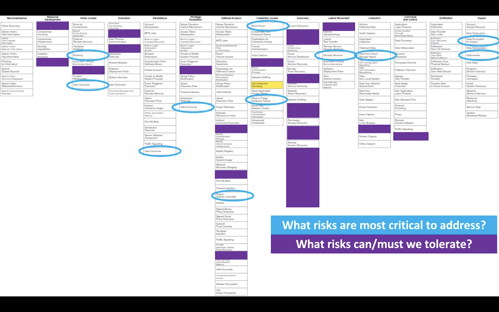

# ATT&CK Fundamentals

### Introduction to ATT&CK

David  Bianco's Pyramid of Pain

TTP
- Tactics
- Techniques
- Sub-Techniques
- Procedures

### Matrices/Platforms

Matrix 
- captures relationships between tactics, techniques, and sub-techniques

Platforms 
- specific operating system or applications

Technology Domains
- Mobile
- Industrial Control Systems

Hybrid
- overlap redundancies exists between matrices

### Tactics

Tactics (Why)
- represent adversary goals for an attack
- are assigned uniques ID's, and lead yo more specific techniques

### Techniques and Sub-Techniques

Techniques (How)
- means by which adversaries achieve there tactical goals

Sub-Techniques
- more specific descriptions of the techniques

Techniques ID's
- Unique identifies
- Technique T####
- Sub-Technique T####.###

Other Technique Metadata
- Mitigations
- Data Sources and Detections
- Procedure Examples

### Mitigations

Mitigations
- configuration, tools, or processes that can prevent a technique from working
- are mapped to specific techniques, and are displayed on those pages

### Data Sources and Detections

Data Sources
- sources of information collected by sensor or logging system
- used to collect information to identify adversary actions

Detections
- high level analytic process, sensors, data and detection strategies
- how to interpret collected data

### Groups and Softwares

Procedures
- specific implementation the adversary used for techniques or sub-techniques
- describe a group or software entity with brief description of how the technique is used

Groups
- related intrusion activity that are tracked by a common name

Softwares
- tools or malware used by an adversary during intrusions

### How ATT&CK Grow and Evolves

Is a Living Framework

Techniques, Groups, Software etc. are designed to be added, deleted, and/or enhanced as needed

Tracking Changes

[Changelog link](github.com/mitre/cti)

### Community Persective

The framework is collectively build from:
- publicly available reporting and documentation
- insights and feedback
- citable contributions from global community

### Common Language

Common language
- a common language for describing cyber adversary behaviour
- language is abstracted to an operational-usage

ie. OS Credential Dumping: LSASS Memory (Mimicatz)
CTI analyst : This is a very common tradecraft across many groups and software
Red team : The behaviour is reading lsass.exe from memory
Soc analyst : We should monitor process accessed to lssas.exe

### Quantitative Scorecard

Documenting Priorities
- What techniques are most important to us?

Identifying Gaps
- What techniques do we have defences for?

Informing Decision Making
- Where do we need to improve?

### ATT&CK Navigator

ATT&CK Navigator
- enables us to annotate, save, and share customized views of ATT&CK

Navigator Layers
- Custom views on the ATT&CK matrix
- can be created interactively with Navigator or generated programmatically (JSON)

[Accessing ATT&CK Navigator link](mitre-attack.github.io/attack-navigator/)

### Operationalizing ATT&CK

Threat-Informed Defense
- systematic application of a deep understanding of adversary tradecraft and technology to prevent, detect and respond to cyber attacks.

### Cyber Threat Intelligence

- is all about knowing what adversaries do

### Detection and Analysis

What can we do with intelligence?

ie. OS Credential Dumping: LSASS Memory (Mimicatz)

Behavior-Based Analytics

Detection > Monitor for unexpected processes interacting with LSASS.exe.

### Threat Emulation

Intelligence-Driven Emulation
- red teaming mimicking known threats
- operationalize intelligence
- observe and evaluate our defences form the perspective of our adversaries

### Assessment and Engineering

The Goal is Improvement
- Find and Fix
- Threat-Driven Engineering

