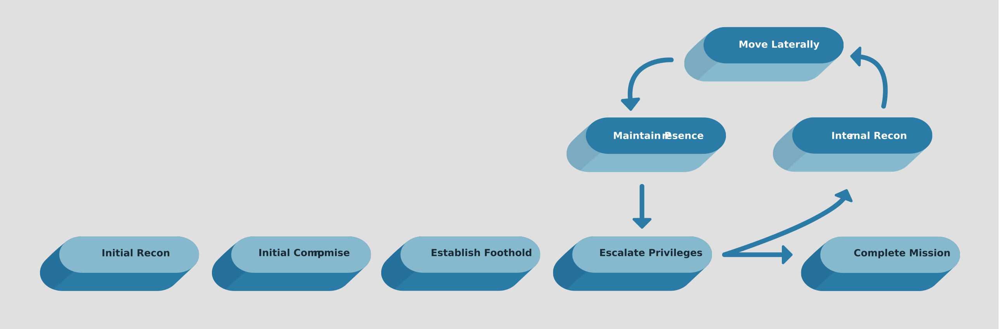

## Ransomware: Identify, Protect, Detect, Recover

### What is Ransomware?

### Ideas in Ransomware

It’s far more efficient from a revenue perspective to infect businesses (where they can demand large payments) than to infect home systems (where they may be less likely to get paid or the payment is going to be much smaller). 

The problem, though, is that if attackers infect a system and immediately start encrypting files, someone is going to raise an alert before the attacker can move to many more systems.

//Take-away: attackers dont trigger ransomware immediately as they they to pivot and infect more devices

There may be several file extensions in place on any given system, and it’s possible a file extension is related in some way to a client ID that has been assigned by the ransomware “vendor.”

//Take-away: ransomware family can be identintified by how it encrypt file extensions

The ransomware will not typically affect .exe or .dll files and directories like Program Files and Windows directories

### Threat Intelligence

Treat intelligence is information about the way attackers work.

### Apply Threat Intelligence

Cybersecurity Framework
-identify
-protect
-detect
-respond
-recover

anti-malware tends to miss ransomware because anti-malware is still primarily signature-based

When attackers install malware that communicates with C2 nodes, they use hostnames for the C2 nodes

If you know the hostname or the domain name more accurately, ahead of time, you can do two things

- First, you can institute block rules on your system’s firewalls or blacklist DNS for that domain so that your system’s IP addresses can’t be looked up.

- Additionally, you want to be able to have alert rules, either on your DNS server or from some network intrusion detection system, to notice when a system tries to communicate to that IP address.

Blocking the domain lookup or communication isn’t going to stop the malware from getting in to begin with, but you can more quickly identify systems that have been compromised

### Source of Threat Intelligence

1. commercial vendor
2. threat intelligence feed sold by 3rd parties
3. open-source threat information like MISP Project

SIEM take in log data coming from your systems and network devices, as well as data from a threat feed.

### Information Sharing

Every organization has its own information about attacks.

national council of ISACs

### Decrypting Ransomware

Key management is one of the most important aspects of any encryption scheme.

Each family of ransomware is probably going to use a different cipher type.

Common encryption algorithm
- Advanced Encryption Standard (AES)
- Blowfish // oudated succeded by Twofish cipher

Common key sizes
- 128-bits // This is 340,282,366,920,938,463,463,374,607,431,768,211,456 possible keys

Threat intelligence services may provide you with pointers to decryptors.

Software configuration management -> Microsoft’s System Center Configuration Manager (SCCM).

Module Summary

In any given month between 8 and 17 million new pieces of malware were introduced.

Threat intelligence is a way to help counter the problem of anti-malware being insufficient. 

You can’t prevent bad things from happening all the time, but if you get a head start and educate yourself, you can institute controls across your organization that can help you at least minimize the damage.

### Protection vs Remediation

good, overall security program has multiple phases

Identify and protect

Detect: When something bad happens, you want to know about it as quickly as possible perform tasks like logging data and creating alert rules

Respond and recover

### Threat-Informed Email Protection

The most common attack method is not a technical attack.

Today’s attacker knows that the most effective technique is to use email.

Additionally, the weakest link in any security program is always going to be the user.

The easiest way into an environment is likely going to be by sending an email to a user.

 Threat information related to email is going to include email addresses, source IP addresses, subject lines, and even some content. 
- You could use something like Mimecast, Proofpoint, or Microsoft’s Advanced Threat Protection. 
- It could reject, block, or quarantine messages that look suspicious.

Some enterprises will choose to prevent any attachments of configured file extensions from being delivered
- executables (.exe)
- compressed files (.zip)
- Microsoft Office documents (.docx, .xlsx)

Sometimes overlooked, though probably worse than macros, is the portable document format (PDF) file.
- This file can contain executable code and can easily be used to attack systems where the file has been opened. 

### Security Awareness and Training

primary avenue for attacks today is social engineering

Unfortunately, a lot of organizations see technology as the best way to protect the organization.

it should always be paired with arming the first line of defense with enough knowledge to protect the business when attacks get through the (email) protection technology and to give a fast alert to warn other users. In the end, humans are going to be human. 

### Backup Strategy

Backups are a good way to recover from a ransomware attack.

You need to think about what your backup strategy will be.

- How often are you going to back up data? 
- Where are you going to back it up? 
- What data are you going to back up? 

Once you have a backup solution in place, it’s essential to educate all your staff to place business-critical information in places where it will be backed up.

Don’t assume that backups are always reliable.

You should also periodically do restoral tests to be certain that the software is telling you the truth and the media you are using to store your backups is reliable

### Network Segmentation

Networks should be typically segmented, meaning that all of your systems are not on the same network.

this is done using virtual local area networks (VLANs)

Effective segmentation occurs when you can control the flow of traffic from one network segment to another.

this may mean a firewall between the different VLAN or access control lists.

The best way to implement segmentation is to connect all of your VLANs to a firewall or firewalls, which will perform the routing from one VLAN to another.

You should be able to connect a firewall to a single switch port, and then use something called trunking to get traffic from all your VLANs passing over that single connection.

### Isolation and Containment

the goal of containment is to keep the malware or ransomware from infecting other systems

New infections aren’t as rapid, because they require a human to identify the next target and find a way in, there is value in being able to contain systems that have been infected. 

### Regulatory Concerns

Any solid information security program will be aware of regulatory bodies that have some control over the organization. 

ie. Payment Card Industry (PCI) for payment cards

ie. Sarbanes Oxley (SOX) law which controls how financial records are handled for public companies.

General Data Protection Regulation (GDPR) law in Europe

California Consumer Privacy Act (CCPA) law in California 

### Cyber Insurance

Cyber Insurance can help to transfer some of the risks of a ransomware attack because not all the costs will have to be covered by the organization that has been attacked

Ideally, you would have a solid backup strategy and you wouldn’t worry about paying to get your data back.
- The problem with that, though, is that restoring hundreds or thousands of systems can be time-consuming. 

The insurance company may have other ideas, however. Clearly understand what the insurance provider’s perspective on ransomware is.

They may have a pay-the-ransom attitude since it’s probably cheaper to apply a key and get data decrypted than it is to wipe and restore a large number of systems.

Another consideration when it comes to ransomware is that the insurance company may not be willing to pay for an investigation.

Two purposes of an investigation are important considerations for the business.
- first is how the attack happened (especially the entry point of the attack)
- second is to ensure that the attack was limited to a ransomware attack (If the attacker also had software installed that allowed them remote access)

### Ransomware Negotiation

If you intend on paying the ransom, a negotiator may reduce the overall cost of the ransom for you.

In addition to reducing the amount of payment, using a negotiator might give you some additional time.

When you are considering a ransomware negotiator, you should consider the following criteria.
- First, this is the sort of thing you want to have in place ahead of time
- You want to be sure you select a company with a track record of successful negotiations.
- You want a negotiator who understands threat actors, their motivations, and their strategies.
- Finally, they need to be able to work closely with crisis management plans and staff. 

### Effective Communications

Your first thought may be all the customers you have to notify if part of the ransom is data theft.

external communications 
- discolsure when a breach happens

internal communications
- make it clear that no one should talk about what is happening in the organization

The company should speak with one clear voice if communication is deemed necessary.

### Module Summary

The following are considerations for a ransomware plan:

1. Implement a solid backup strategy—when a ransomware attack happens, having a solid backup strategy can help the process of recovery go more smoothly. Systems can be wiped and reinstalled, then restored from backup.
2. Implement security awareness training—security awareness training can help keep employees vigilant to the different ways attackers might try to take advantage of users to gain access to the environment.
3. Consult with legal counsel—make sure you have plans in place with legal counsel. They will understand legal and regulatory considerations.
4. External entities—you are likely going to need help if you are impacted by a ransomware event, so get retainers in place for the following: incident response company, ransomware negotiation company, crisis communication company, and external counsel experienced with security-related incidents.
5. Introduce or enhance threat intelligence—getting a threat intelligence provider will help you better protect and respond to all of the threats in the world today.
