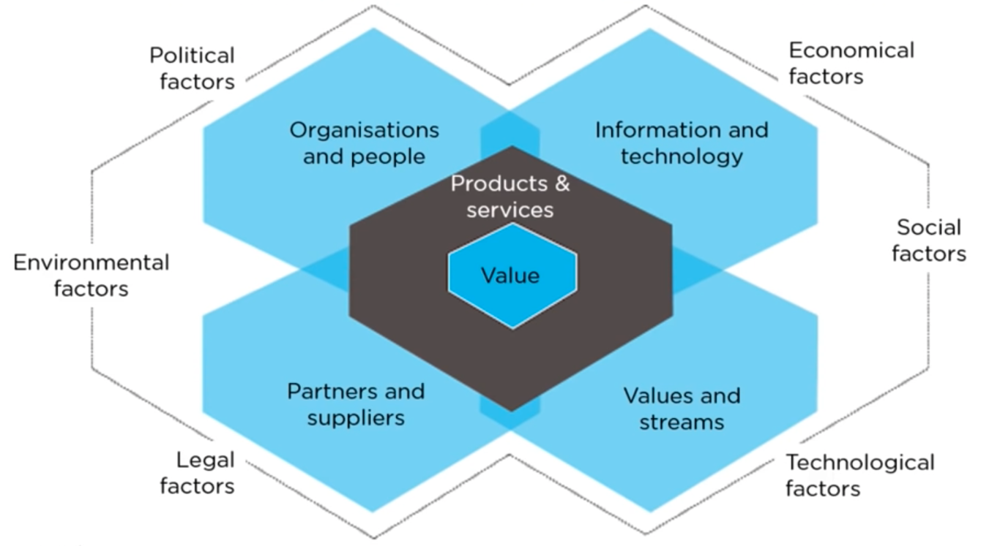
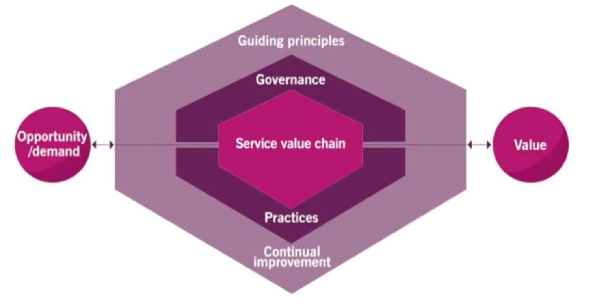
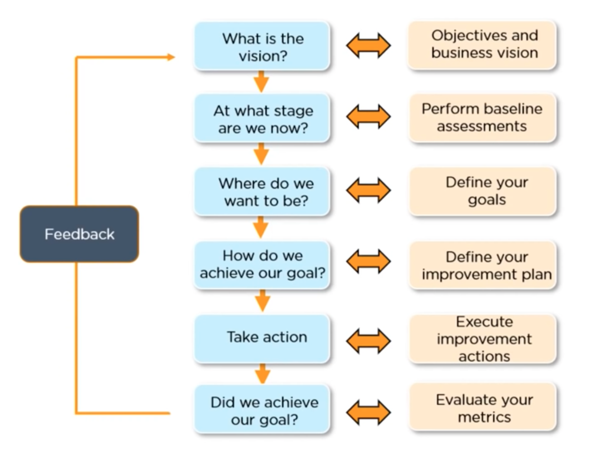

# ITIL 

### What is ITIL?
ITIL - Information Technology Infrastructure Library

*"Improve service and reduce IT cost"*

### ITIL Concepts

v1

Availability Management 
- available based on business requirement

Capacity Management 
- manages performance based issues

Contingency Management 
- identifying vulnerabilities and help prevent such incidents

Cost Management 
- delivering and managing cost-effective IT assets and resources

v2

Service Support 
- deliver processes for controlling service interruptions

Service Delivery 
- set principles, policies and constraints which can utilize designing building and deploying services

v3 

Service Strategy 
- understand clients requirements

Service Design 
- designing IT services efficient and effectively

Service Transition 
- plans, builds, tests, and deploys services into customer environments

Service Operations 
- ensures access to IT services for only authorized users

Continual Service Improvement 
- ensures IT services are aligned to business needs using 7 step model

7 step model

1. Identifying the strategy
2. Define what you will measure
3. Gather the data
4. Process the data
5. Analyze the information
6. Present and use the information
7. Implement improvement

v4

### The Four Dimmensional Model

Organization and People
- people in the organization should understand their roles and responsibilities 

Information and Technology
- information knowledge and techniques that are required for managing services

Partners and Suppliers 
- contracts between organizations and their partners

Values Stream and processes
- steps used to create and deliver products and services to the consumer and a defined process that can improve productivity

### ITIL Service Value System 

Guiding principles 
- set of guidelines

Governance 
- controls and monitors performance of the organization

Service Value Chain 
- set of activities that a business performs to deliver valuable service to its consumers

Continual Improvement 
- iterative approach to ensure performance meets customers expectations

Management Practices 
- 34 management practices which are designed for accomplishing organization goals

### Certifications

ITIL Foundation

*service lifecycle and service management practices*

## ITIL v4 Foundation 

### What is ITIL v4 

- set frameworks for IT service management that helps in aligning IT services with the requirements of a business

*improve efficiency and achieve predictable service delivery*

### ITIL v4 focuses on:

Value 
- create value for its stakeholders

Outcome 
- result driven service

Co-creation on value 
- maintain iterative relationship with its stakeholders 

Managing specific costs and risks 
- amount of money spend on specific activities should be managed wisely

### Elements 

### Four Dimensions

1. Organization and People

2. Information and Technology

3. Partners and Suppliers 

4. Values Stream and processes

### Six External factors: PESTLE 

1. Political factors

2. Economica factors

3. Social Factors

4. Technological factors

5. Legal factors

6. Environmental factors

### ITIL service value system

Opportunity/Demand
- Opportunity : needs of customers realized by service provider to fulfils
- Demand : requirement for products and services from customers

Guiding principles 
- Focus on value : every task an organization does should bring value to its stakeholders
- Start where you are : assess & analyses the current scenario to identify and improve
- Progress iteratively with feedback : opt for feedback every iteration
- Collaborate and promote visibility : collaborate with customer, users, etc. as it helps in creating higher value
- Think and work holistically :  create processes that adds value to customers 
- Keep it simple and practical : opt for minimum steps that are correct and do not add processes 
- Optimize and automate : automate tasks to be more efficient

Governance 
- Evaluate : performance of services based on requirements
- Direct : management provides direction to people in order to achieve organizational goals
- Monitor : monitor the performance of the organization and check the services if it is inline with the organization's goal

Service Value Chain 
- Plan : creating plans provided by the organization
- Engage : good understanding of stakeholders requirements and should continue to maintain a good relationship
- Design & transitions: focuses on creating and releasing new and changed services
- Obtain & build : development and manage the infrastructure 
- Deliver & support : ensure services are delivered and support the stakeholders expectations
- Improve : focus on improving performance of infrastructure and third party services

Management Practices 
- General management : applicable across the whole organization
- - Information security management
- - Relationship management
- - Strategy management
- - Portfolio management
- - Architecture management
- - Service financial management
- - Workforce and talent management
- - Continual improvement
- - Measurement and reporting
- - Risk management
- - Knowledge management
- - Organizational change management
- - Project management
- - Supplier management

- Service management
- - IT asset management
- - Monitor and event management
- - Business analysis
- - Service catalogue management
- - Service design
- - Service level management
- - Availability management
- - Capacity and performance management
- - Service continuity management
- - Service desk
- - Incident management
- - Service request management
- - Problem management
- - Release management

- Technical management
- - Development management
- - Software development and management
- - Infrastructure and platform management

Continual improvement
- The ITIL continual improvement model: structured approach to organization in order to bring improvement
- The improve service value chain activity : establish continual improvement into service value chain
- The continual improvement practice : support day to day improvement efforts

Example:

Value
- valuable outcome

Resources:
https://youtu.be/951xIKQmols
