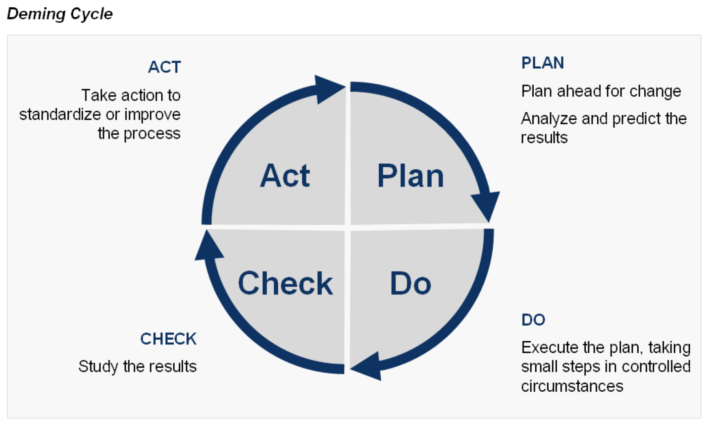
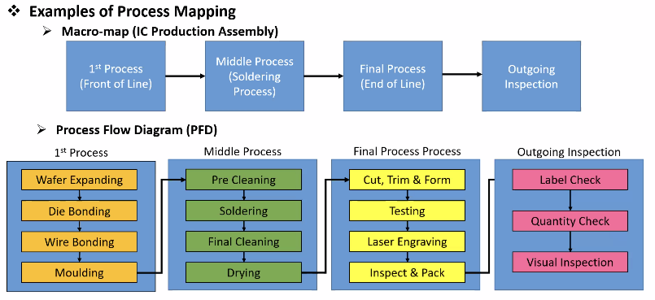
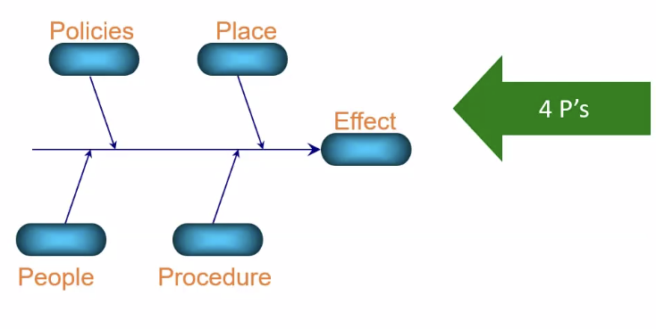
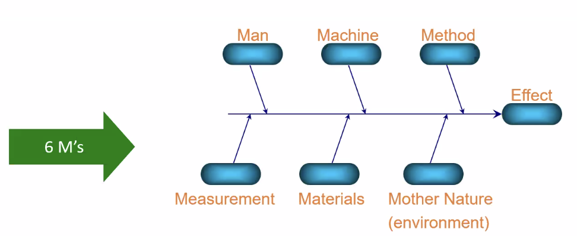
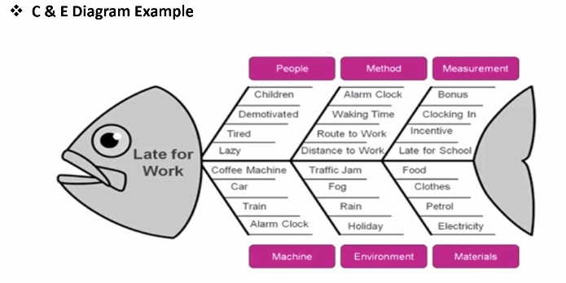

# Lean 6σ Methodology 

## Lean

### What is Lean Manufacturing?

*“Efficient with no waste”*

*Eliminating waste & improving the process to achieving high **Quality Product** (service) that results in **Customer Satisfaction**.* 

### What is the Lean Thinking?

***Continuous Improvement***

### Deming Cycle

① > Plan > Do > Check > Act > ①

### Objectives of Lean Manufacturing

1. Eliminate Waste 

2. Reduce Cost

3. Reduce Time

4. Customer Satisfaction

### Lean: Eliminate Waste

Identify Value 
- what are the customers needs based on their requirements and expectations?

Value Streaming 
- what are the steps and processes needed for the project?

Establish Flow 
- guidelines to follow ensuring smoothly without any interruptions

Pull Value 
- deliver product just on time

Strive for Perfection 
- continuous improvement

### 7 Types of Waste (TIMWOOD)

1. Transport - material movement
- poor layout
- lengthy material handling
- multiple storage location

2. Inventory - materials that are not sold/used that becomes obsolete  
- over production
- long changeover time
- mismatched production speed

3. Motion - excessively movement
- poor office layout
- no standardized work instructions

4. Waiting - idle time
- long changeover
- machine downtime

5. Overproduction - result from producing faster than required 
- large batch sizez 
- inacurate forcast

6. Overprocecssing - extra effort beyond the customer requirment

7. Defect - errors that occur in a process
- lack of standards
- material handling
- process design

### 8 Downtime

8. Non-utilized Talent - not utilizing employees brain
- people mindset (not my job mindset)
- job descrimination

---

## 6σ 

### What is Six Sigma?

*Data driven methodology eliminating defects and variations*

*Toolbox that consist of systematic way, method & approach in reducing defects/variation processes towards achieving high **Quality Product** (service) that results in **Customer Satisfaction**.* 

### Objectives of Six Sigma

1. Lower cost

2. Higher customer satisfaction

3. Shorter cycle time

4. Predictable processes

### Goal

| σ Level | Defect Rate | Yield    | DPMO     |
| ------- | ----------- | -------- | -------- |
|   3σ    |   6.7000    | 93.30    | 66,807.0 | 
|   4σ    |   0.6200    | 99.38    | 6,210.0  | 
|   5σ    |   0.0230    | 99.977   | 233.0    | 
|   6σ    |   0.0003    | 99.99997 | 3.4      | 

&nbsp;

### 6 Sigma: Eliminate Defect & Variations

Define 
- Project & Objectives

Measure 
- What do we need to improve?

Analyze 
- Process & Factor of Influence

Improve 
- Implement Improvement

Control 
- Assure that Improvement will sustain

### DMAIC Process

Define
- Identifying *Issues* and *Problems* that are critical to quality process

1. Problem Scope
- Critical to Quality

2. Problem Statement 
- Clearly define the problem

3. Project Metrics
- used to measure process performance

4. Project Objectives - SMART
- Specific
- Measurable
- Achievable
- Relevant
- Time-bound

5. Team Members
- alone does his organization and himself a fret disservice

Measure
- Gathering information about the problems to establish *Baseline* for improvement

1. Data Collection Systems

- Types of Data
    1. Continuous Data - measuring and can take any value within a given range
    2. Discrete Data - exact value

- Methods of Sampling
    1. Random sampling - unstuctured or does not follow any pattern
    2. Systematic sampling - from a larger population are selected according to a random starting point and a fixed periodic interval 
    3. Stratified sampling - division of population into smaller group known as strata

2. Process Maps & Simplification
- graphical display step-by-step the process

- Type of Process Mapping 
    1. Macro-Map - major processes
    2. Process Flow Diagram - visual representation of every steps

3. C&E for Variable Reduction
- cause and effect diagram (Fish Bone)

Analyze
- *Analyze*, *Test* & *Validate* the data to identify the root cause of a problem for improvement

1. ID Variation: Graphical Analysis
- Data representation in graphical form

- 7-QC Tools
    1. Line Graph 
    2. Bar Graph
    3. Scatter Chart
    4. Flow Chart
    5. Histogram
    6. Box Plot
    7. Cause & Effect diagram

2. ID Variation: Statistical Analysis

- 5 Why Analysis
    1. Write down the specific problem
    2. Ask Why the problem happens and write the answer down below the problem
    3. If the answer you just provided doesn't identify the root cause of the problem that you wrote down in step 1 as Why again and write that answer down
    4. Loop back to step 3 until the team is in agreement that the problems root cause is identified
    5. Sometimes this may take fewer or more times that five Whys

### Improve
- Develop a potential solution in a problem by *Improving* the current process

1. Y = f(X) methodology

2. Recommended Changes - continual improvement 

- Plan : Establish the necessary objectives and processes to deliver results in accordance with the expected output

- Do :  Execute base from the plan

- Check : Validate & compare the result base from exceptions

- Act : Take action base from the comparison result

### Control
- *Sustaining* the improvement solution to  avoid potential quality reoccurrence issue

1. Control X's & Monitor Y's

2. Project Closure 
- Establish systems for frequent measurements

- Update the procedures and documentation

- Take time to truly educate

- Monitor the results
