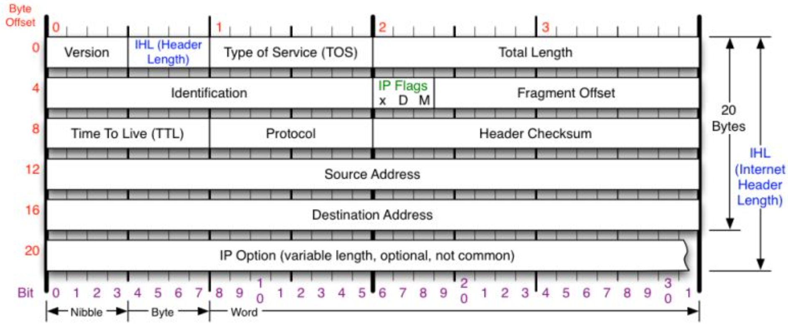
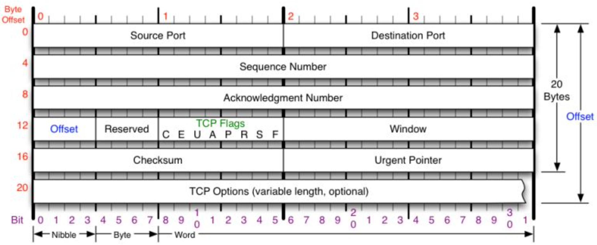
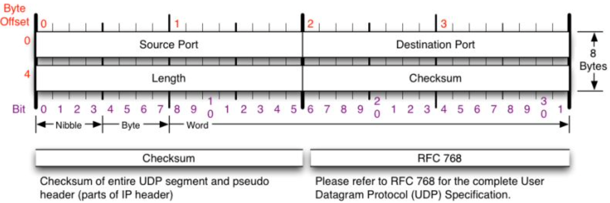

# SOC Analyst Core Skills

Description

## Windows commands:

### netstat: Displays active TCP connections, ports on which the computer is listening

```
netstat -naob
```

- -n: Displays active TCP connections, however, addresses and port numbers are expressed numerically and no attempt is made to determine names.
- -a: Displays all active TCP connections and the TCP and UDP ports on which the computer is listening.
- -o: Displays active TCP connections and includes the process ID (PID) for each connection.
- -b: Displays the executable involved in creating each connection or listening port.

```
netstat -f
```

- -f: Show fully qualified domain name
### tasklist: Displays a list of currently running processes on the local computer or on a remote computer.

```
tasklist /m /fi “PID eq <PID>"
```

- /m: Lists all tasks with DLL modules loaded that match the given pattern name.
- /fi: Specifies the types of processes to include in or exclude from the query.

### wmic: Displays WMI information inside an interactive command shell.

Show all process in list

```
wmic process list full
```

Show the name, parent PID, PID of all process

```
wmic process get name,parentprocessid,processid
```

Show what executed the *PID*

```
wmic process where processid=<PID> get commandline
```

---

## Linux directories:

_EVERYTHING IN LINUX IS A FILE_

| directory | description                                  |
|-----------|----------------------------------------------|
| /bin      | user binaries                                |
| /boot     | boot loader files                            |
| /dev      | device files                                 |
| /etc      | system configuration files                   |
| /home     | user home directory                          |
| /lib      | libraries and kernel modules                 |
| /media    | removable media mount point                  |
| /mnt      | mount point for temporary mounted file system|
| /opt      | add-on application software packages         |
| /sbin     | system binaries                              |
| /proc     | process information                          |
| /srv      | data for services                            |
| /tmp      | temporary files                              |
| /usr      | user utilities and application               |
| /var      | variables files                              |
| /root     | home directory for the root user             |
| /proc     | virtual file system                          |

&nbsp;

---

## Linux commands:

### grep: Print lines matching a *pattern*

```
grep <pattern> 
```

### locate: Find files by *name*

```
locate <name>
```

### ps: Display current processes 

```
ps aux
```

- a: all
- u: user-oriented
- x: executables 

### top: Display running process

```
top
```

### ifconfig: Displays IP addresses of all network interfaces

```
ifconfig 
```

### ping: Send ICMP echo requests to *ip addr* 

#ping

```
ping <ip addr>
```

### nmap: Network exploration tool and security / port scanner

Show open ports in *ip addr*    
#port

```
nmap <ip addr>
```

Show UDP scan on *port no* in *ip addr*      
#parse 

```
nmap -sU -p <port no> <ip addr>
```

- -sU: UDP scan
- -p: port

### netstat: Display network connections

```
netstat
```

### lsof: List open files

```
lsof -i -P
```

- -i: ip address
- -P: port

### USEFULL! (Proc and Processes)

desciption yadayada

#proc

```
cd /proc/<PID>
```

#strings

```
strings exe
```

---

## Networking

### IP Header



### TCP Header



### UDP Header



### 3-Way Handshake

- Sys
- Sys/Ack
- Ack

### Top 20 Ports

| port no. | service        | port no. | service        |
|----------|----------------|----------|----------------|
| 21       | ftp            | 143      | imap           |
| 22       | ssh            | 443      | https          |
| 23       | telnet         | 445      | microsoft-ds   |
| 25       | smtp           | 993      | imaps          |
| 53       | dns            | 995      | pop3s          |
| 80       | http           | 1723     | pptp           |
| 110      | pop3           | 3306     | mysql          |
| 111      | rpcbind        | 3389     | ms-wbt-server  |
| 135      | msrpc          | 5900     | vnc            |
| 139      | netbios-ssn    | 8080     | http-proxy     |

&nbsp;

### tcpdump: Dump traffic on a network

```
tcpdump -D
```

- -D: List network interface

```
tcpdump -i <network interface> -XA 
```

- -i: interface
- -X: Hex
- -A: ASCII

```
tcpdump -n -r <file.pcap> -XA host <ip addr> and port <port>
```

- -n: do not resolve names
- -r: read
- host: filter ip addr
- port: filter port no

```
tcpdump -w <file.pcap> 
```

- -w: write  

### Wireshark

Select Interface


Packet Breakdown


Follow TCP Stream


Statistics > Endpoints


Statistics > Conversations


Statistics > Protocol Hierarchy


Statistics > HTTP > Requests


---

## Memory Forensics Analysis

### Volatility 2.6

Memory Analysis: Network

```
volatility_2.6_win64_standalone.exe -f <file.vmem> netscan --profile=Win10x64_10586
```

- netscan: Scan a Vista (or later) image for connections and sockets
- -f: file
- --profile=: windows build

Memory Analysis: Processes

```
volatility_2.6_win64_standalone.exe -f <file.vmem> pslist --profile=Win10x64_10586
```

- pslist: Print all running processes by following the EPROCESS lists
- -f: file
- --profile=: windows build

Memory Analysis: DLL

```
volatility_2.6_win64_standalone.exe -f <file.vmem> --profile=Win10x64_10586 dlllist -p <PID>
```

- dlllist: Print list of loaded dlls for each process
- -f: file
- --profile=: windows build
- -p: PID

---

## Egress Traffic Analysis

### Netflow

A network protocol for collecting IP traffic information and monitoring network flow

[SolarWinds Netflow](https://www.solarwinds.com/netflow-traffic-analyzer/use-cases/what-is-netflow)

### Zeek

A powerful framework for network traffic analysis and security monitoring.

[Zeek Github](https://github.com/zeek/zeek)

### RITA

An open source framework for network traffic analysis.

[RITA Github](https://github.com/activecm/rita)

### JA3

A method for creating SSL/TLS client fingerprints that should be easy to produce on any platform and can be easily shared for threat intelligence.

[JA3 Github](https://github.com/salesforce/ja3)

### Security Onion

A free and open source Linux distribution for threat hunting, enterprise security monitoring, and log management

[Security Onion Github](https://github.com/Security-Onion-Solutions/security-onion)

---

## User Entity Behavior Analysis

### Stacking

User Login = +1 User Logout = -1

Example: @Threshold of 6 per day

User Login = +2000 --> will trigger alert

### AI

AI learns what is normal for each user account 

Example:

Bob normaly logs into 3 systems every day

Bob logs into 40 systems --> will trigger alert

---

## Log Analysis

### JPCert Logon tracer

A tool to investigate malicious logon by visualizing and analyzing Windows Active Directory event logs. This tool associates a host name (or an IP address) and account name found in logon-related events and displays it as a graph.

This tool can visualize the following event id related to Windows logon:

4624: Successful logon

4625: Logon failure

4768: Kerberos Authentication (TGT Request)

4769: Kerberos Service Ticket (ST Request)

4776: NTLM Authentication

4672: Assign special privileges

[Logon Tracer Github](https://github.com/JPCERTCC/LogonTracer)

### Important Windows Event Logs

| event id               | service                          |
|------------------------|----------------------------------|
| 4624, 4634             | Logon / Logoff                   |
| 4662                   | ACL’d object access - Audit req. |
| 4688                   | process launch and usage         |
| 4698, 4702             | Acct Lockout + Src IP            |
| 5152, 5154, 5156, 5157 | FW - Noisy                       |
| 4648, 4672, 4673       | Special Privileges               |
| 4769, 4771             | Kerberoasting                    |

&nbsp;

### Enable Command Line Logging

Admin. Templates > System > Audit Process Creation

Policies > Windows > Security > Advanced Audit > Detailed Tracking

Def. Domain Policy > Computers > Security > Local > Security > Audit

### Enable Powershell Logging

```
WevtUtil gl "Windows PowerShell" (list configuration)
WevtUtil sl "Windows PowerShell" /ms:512000000
WevtUtil sl "Windows PowerShell" /rt:false
WevtUtil gl "Microsoft-Windows-PowerShell/Operational" (list configuration)
WevtUtil sl "Microsoft-Windows-PowerShell/Operational" /ms:512000000
WevtUtil sl "Microsoft-Windows-PowerShell/Operational" /rt:false
```

### Sysmon 

[Download Sysmon](https://docs.microsoft.com/en-us/sysinternals/downloads/sysmon)

### Winlogbeat 

[Download Winlogbeat](https://www.elastic.co/beats/winlogbeat)

---

## End Point Protection Analysis

### asd

### 

### 

---

## Internal Segmentation and Isolation 

### asd

---

## Vulnerability Managment

### Burp Suite Pro

Most used tools for web pentesting

Intercept Mode

Crawl

Active Scan

### Zedd Attack Proxy

asd

---